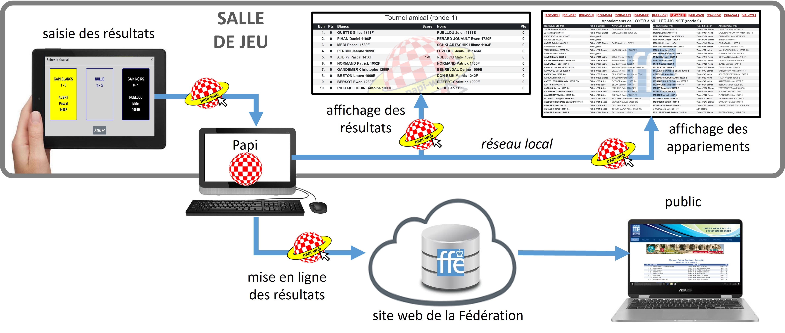

**[Retour au sommaire de la documentation](../README.md)**

# Papi-web - Présentation

## Papi-web, c'est arrivé comment ?

Papi-web est né de quelques observations simples : 

- Pendant les tournois, les arbitres « à l'ancienne » (qui se reconnaitront :-) ) passent un temps non négligeable sur le clavier de leur ordinateur à entrer les résultats des joueur·euses, puis à les vérifier ; l'arbitrage des parties en souffre, c'est pourtant le coeur de métier des arbitres !
- La saisie des résultats par l'arbitre est souvent source d'erreurs, en simple saisie en cadence lente à cause des erreurs sur les feuilles de partie, et surtout en double saisie en cadence rapide quand les joueur·euses notent leur scores sur un papier et que l'arbitre les reporte ensuite dans la « boule Papi » ;
- Il faut attendre la fin des rondes pour en connaître les résultats, difficile de communiquer sur les aspects sportifs d'un évènement échiquéen dans ces conditions...
- Sur des opens rapides en faible cadence (typiquement 9 rondes en 12 minutes et 3 secondes par coups), les retards s'accumulent sur la journée à cause des temps de saisie, les pauses déjeuner sont raccourcies, les remises des prix ont lieu systématiquement en retard, ...

Papi-web est ainsi né en septembre 2013 pour la [7e édition de l'open rapide de Domloup](http://domloup.echecs35.fr/node/1561), et son utilisation avait été relayée dans le [BAF n°135](http://www.echecs.asso.fr/Arbitrage/Baf135.pdf) ([Bulletin des Arbitres fédéraux](http://www.echecs.asso.fr/Default.aspx?Cat=5)). Depuis cette date, le logiciel n'a cessé d'évoluer grâce aux contributions et sous l'impulsion des utilisateur·trices...

_Première utilisation de Papi-web dans une compétition homologuée en 2013_

En mai 2018, un débriefing avec Pierre LAPEYRE après un stage d'arbitrage à Domloup se conclut à une heure très avancée sur une conclusion simple : il faut absolument diffuser Papi-web pour permettre aux arbitres de se concentrer sur leur coeur de métier, et il faut pour cela le mettre en place sur une manifestation de masse. Après un test grandeur nature quelques semaines avant au festival international de Metz par Eric DELMOTTE, la décision est prise d'utiliser Papi-web au championnat de France et ce sont Pierre LAPEYRE et Eric DELMOTTE qui en font la promotion à Nîmes en août 2018 ([voir la vidéo](https://www.youtube.com/watch?v=u2arqnRH9SA)) !

## Papi-web, c'est quoi ?

C'est un programme qui permet :
- La saisie des résultats par les joueurs eux-mêmes, directement dans la « boule Papi » de l'arbitre ;
- L'affichage des tournois gérés sur le site fédéral ;
- La mise en ligne des résultats sur le site fédéral en temps réel ;
- Le téléchargement des factures d'homologation depuis le site fédéral.

## Papi-web, ça sert à quoi ?

Papi-web permet aux arbitres de se concentrer sur leur job, qui consiste essentiellement à arbitrer les parties d'échecs, en minimisant le temps passé sur l'ordinateur à entrer les résultats des joueur·euses, les contrôler, ...

Papi-web participe à l'animation des tournois grâce à l'affichage des résultats en temps-réel, qui est particulièrement apprécié des accompagnateur·trices dans les compétitions jeunes, et par le public en général pour les autres compétitions.

L'affichage permanent d'un timer permet également aux joueur·euses de se préparer dans les temps pour les rondes.

## Papi-web, comment ça marche ?

Une page web dans la salle de jeu présente aux joueur·euses les matches de la ronde en cours, ceux-ci sélectionnent leur table puis indiquent leur score, qui est enregistré directement dans la « boule Papi ». L'arbitre n'a plus qu'à gérer, dans le logiciel Papi :

- les appariements, comme il le fait habituellement ;
- les éventuelles erreurs de saisie, extrêmement rares lorsque la saisie est faite par les joueur·euses eux·elles-mêmes.

En parallèle, un programme en ligne de commande se charge de mettre en ligne sur le site fédéral les « boules Papi » dès qu'elles sont modifiées, en temps-réel.

## Papi-web, qui l'utilise ?

Le logiciel Papi-web peut être utilisé gratuitement et sans autorisation par tou·tes celles·ceux qui le considérent comme un Beerware lorsqu'il·elles croisent son auteur :-)

Vous n'en faites pas encore partie ? Lancez-vous en découvrant [les nouveautés de la version 2](02-v2-news.md) !

Pour être prévenu·e des nouvelles versions de Papi-web, il suffit de s'abonner à la liste de diffusion papi-web-news@echecs35.fr (demande par mail à pascal.aubry@echecs35.fr).
 
