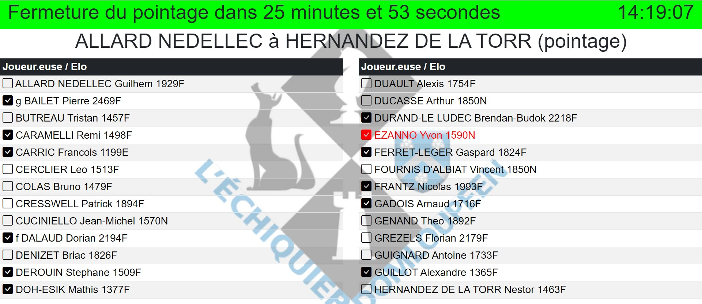

**[Retour au sommaire de la documentation](../README.md)**

# Papi-web - Nouveautés de la version 2

## Installation plus rapide

Papi-web est désormais livré sous la forme d'un exécutable Windows autonome.

> [!IMPORTANT]
> L'installation de XAMPP (ou d'un autre serveur Apache/PHP) n'est plus nécessaire.

À voir : [Installation et mise à jour](05-install.md)

## Configuration plus simple

Papi-web et les évènements sont désormais configuré au format INI :

```
[rubrique]
option = valeur
```

L'écriture de lignes de code PHP n'est plus nécessaire, la configuration d'un tournoi sans personnalisation se fait en quelques secondes :

```
[event]
name = Tournoi amical 17 juin 2023

[tournament]
filename = amical-20230617
```

À voir :
- [Configuration et utilisation](06-use.md)
- [Guide de référence de la configuration des évènements](40-ref.md)


## Utilisation plus simple

Le lancement du serveur indique les URL à accéder (depuis le serveur et depuis un client du réseau local) :

```
C:\...\papi-web-<version>$ server.bat
Papi-web <version>> Copyright © Pascal AUBRY 2013-2024
Starting Papi-web server, please wait...
Reading configuration file...
log: INFO
port: 80
local URL: http://127.0.0.1
LAN/WAN URL: http://192.168.43.85
INFO:     Started server process [XXXXX]
INFO:     Waiting for application startup.
INFO:     Application startup complete.
INFO:     Uvicorn running on http://0.0.0.0:80 (Press CTRL+C to quit)
```

A voir :
- [Gestion d'un petit tournoi amical](11-friendly.md)
- [Gestion d'un tournoi homologué (interface avec le site fédéral)](12-qualified.md)


## Page d'accueil mieux renseignée

La page d'accueil se lance automatiquement au démarrage du serveur web et renseigne sur tous les évènements configurés sur le serveur.


## Une page par évènement

Une page par évènement précise toutes les caractéristiques de l'évènement.


## Simplification de l'affichage multi-écrans

Pour présenter un tournoi sur plusieurs écrans, indiquez simplement la partie que vous souhaitez afficher, Papi-web se charge du reste !

```
[screen.pairings-7.boards]
type = boards
part = 7
parts = 12
```


## Présentation des écrans en plusieurs colonnes

Pour un meilleur affichage, tous les écrans peuvent être présentés en multi-colonnes.

```
[screen.pairings]
type = boards
columns = 2
```


## Affichage des appariements par ordre alphabétique

Pour les tournois à forte participation (à partir d'une centaine de joueur·euses), il est désormais possible d'afficher les appariements par ordre alphabétique.

```
[screen.players]
type = players
```


À voir : [Affichage des appariements par ordre alphabétique](23-pairings-by-player.md)

## Créations des écrans multiples à l'aide de modèles

Pour la présentation multi-écrans, il est possible d'utiliser des modèles (les modifications d'un modèle sont répercutées sur tous les écrans basés sur le modèle).

```
# modèle d'affichage des appariements par ordre alphabétique
[template.alpha]
type = players
columns = 2
menu_text = [%f-%l]
[template.apha.players]
tournament = principal
parts = 2

# écran n°1
[screen.alpha-1]
template = alpha
[screen.alpha-1.players]
part = 1

# écran n°2
[screen.alpha-2]
template = alpha
[screen.alpha-2.players]
part = 2
```

À voir : [Modèles et familles d'écran](34-templates-families.md)

## Création de familles d'écrans multiples

Pour encore plus de souplesse, il est possible de définir toute une famille d'écrans en une fois :

```
# modèle de saisie des résultats
[template.saisie]
type = boards
update = true
columns = 2
menu_text = [%f-%l]
[template.saisie.boards]
part = ?
parts = 10

# écrans n°1 à 10 !
[family.saisie]
template = saisie
range = 1-10
```

Dans l'exemple ci-dessus, 10 écrans de saisie des résultats sont automatiquement créés !

À voir : [Modèles et familles d'écran](34-templates-families.md)

## Écrans rotatifs

Avec la version 1 de Papi-web, les organisateurs s'appuyaient parfois sur des modules externes de navigateurs (Tab Rotate sur Chrome, Tab Rotator sur Firefox, ...) pour permettre une rotation de l'affichage entre plusieurs écrans.

Cette fonctionnalité est intégrée nativement dans la version 2 de Papi-web grâce aux écrans rotatifs :

```
# modèle d'affichage des appariement
[template.appariements]
type = boards
menu_text = Tournoi ?
[template.saisie.boards]
tournament = domloup-fide-?

# 6 écrans d'affichage des appariements pour les tournois A à F
[family.appariements]
template = appariements
range = A-F

[rotator.appariements]
families = appariements
```

> [!NOTE]
> Il est également possible de configurer des écrans rotatifs sur une liste d'écran, par exemple :

```
# modèle d'affichage des tournois
[template.tournoi]
type = boards
menu_text = Tournoi ?
[template.saisie.boards]
tournament = domloup-fide-?

# 6 écrans d'affichage des appariements pour les tournois A à F (tournois nommés tournoi-A à tournoi-F)
[family.tournoi]
template = tournoi
range = A-F

[rotator.tournoi-AB]
screens = tournoi-A,tournoi-B

[rotator.tournoi-CD]
screens = tournoi-C,tournoi-D

[rotator.tournoi-EF]
screens = tournoi-E,tournoi-F
```

À voir : [Écrans rotatifs](35-rotators.md)

## Sources accessibles

Tous les sources de Papi-web sont accessibles sur GitHub : [https://github.com/papi-web-org/papi-web](https://github.com/pascalaubry/papi-web).

## Création des fichiers Papi des tournois à partir de la plateforme d'inscription en ligne Chess Event (à partir de la version 2.1)

Les fichiers Papi des tournois peuvent être téléchargés depuis Papi-web sans nécessiter de logiciel supplémentaire sur l'ordinateur de l'arbitre.

## Meilleure protection des données personnelles des joueur·euses (à partir de la version 2.1)

Les données personnelles des joueur·euses (numéro de téléphone et adresse électronique) sont systématiquement effacées des fichiers Papi avant téléchargement sur le site fédéral.

## Enregistrement des coups illégaux des joueur·euses (à partir de la version 2.2)

Les écrans de saisie permettent d'enregistrer les coups illégaux des joueur·euses.


## Pointage des joueur·euses (à partir de la version 2.3)

Le statut (pointé·e/non pointé·e) est indiqué en temps-réel sur la liste des joueur·euses avant l'affichage des premiers appariements.

Le pointage peut être réalisé depuis les écrans de saisie.



> [!NOTE]
> Le pointage effectué sur la plateforme ChessEvent remplace celui fait dans les fichiers Papi, directement avec Papi ou avec Papi-web ; il est donc déconseillé d'utiliser à la fois ChessEvent et Papi-web pour le pointage.

