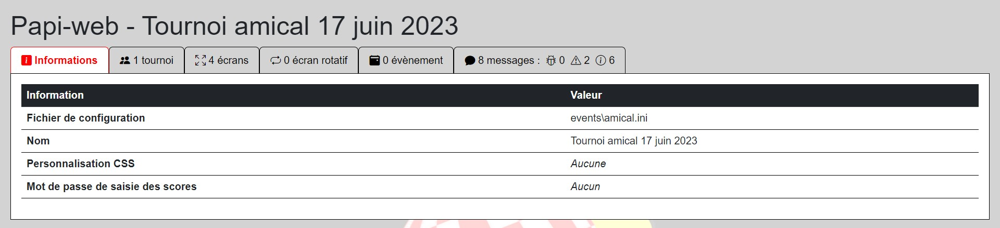
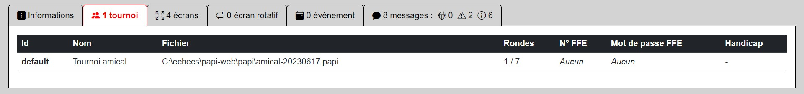
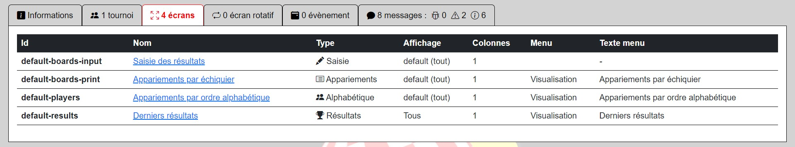
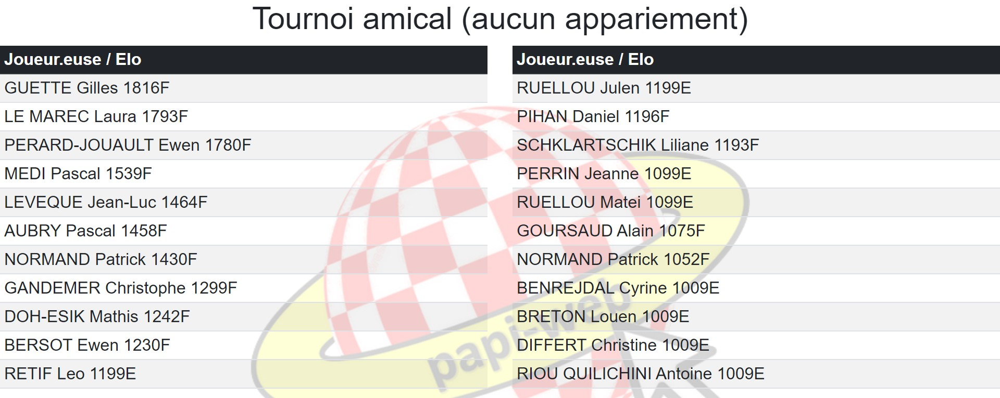
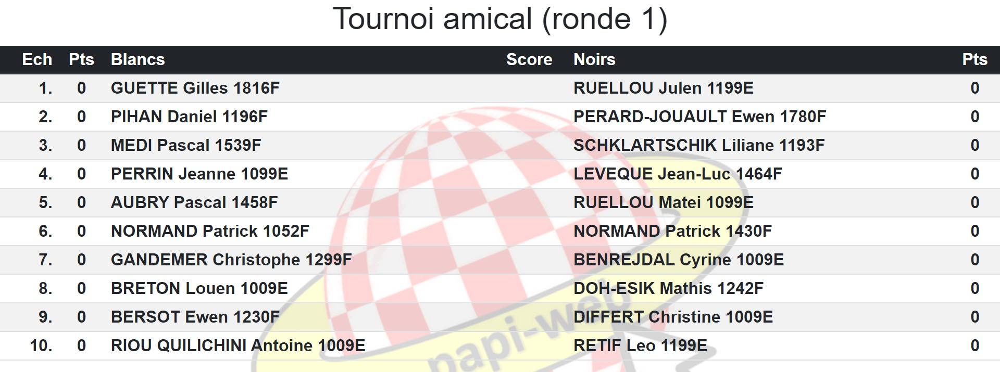
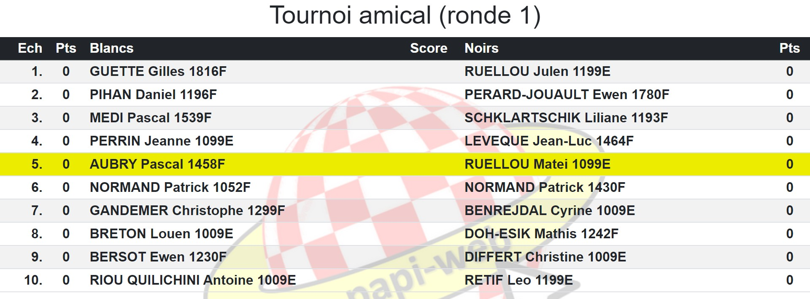
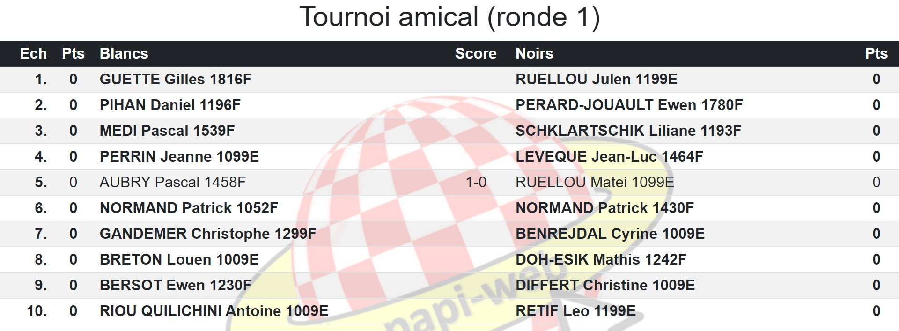

**[Retour au sommaire de la documentation](../README.md)**

# Papi-web - Configuration d'un tournoi amical

Même pour un petit tournoi amical au club, l'utilisation de Papi-web pour l'entrée des résultats permet de fluidifier le déroulement de la compétition.
On crée un fichier `amical.ini` dans le répertoire `events/` pour déclarer l'évènement.
```
[event]
name = Tournoi amical 17 juin 2023

[tournament] 
name = Tournoi amical
filename = amical-20230617
```
La rubrique `[event]` est obligatoire et permet de déclarer le nom de l'évènement.

Le tournoi est nommé `Tournoi amical` et le fichier Papi du tournoi est `amical-20230617.papi`, stocké dans le répertoire par défaut `papi/` (pour le localiser à un autre endroit, on utilisera par exemple `path = c:\echecs\domloup\2023\tournois\amical`)

Démarrer le serveur Papi-Web présente la page d'accueil avec un lien vers la page de l'évènement :




Lorsqu'aucun écran n'est déclaré, Papi-web ajoute automatiquement, pour chaque tournoi, les quatre écrans suivants :



> [!NOTE]
> Les écrans créés automatiquement sont configurés avec des options basiques par défaut. Pour les personnaliser, il faut les déclarer manuellement (suivre les liens ci-dessus pour plus de détails).
> - [Saisie des résultats](21-update.md)
> - [Appariements par échiquier](22-pairings-by-board.md)
> - [Appariements par ordre alphabétique](23-pairings-by-player.md)
> - [Derniers résultats saisis](24-last-results.md)

L'écran de saisie peut directement être utilisé ; avant l'appariement de la première ronde, les noms des joueur·euses sont affichés :


Puis les appariements apparaissent dès que l'arbitre a apparié les joueur·euses dans le logiciel Papi :


> [!NOTE]
> Lorsque des modifications sont apportées à un tournoi dans le logiciel Papi, les écrans liés à ce tournoi se rafraichissent automatiquement pour refléter les modifications.

Il ne reste plus qu'à demander aux joueur·euses de saisir leurs résultats...




...puis apparier la ronde suivante, dans le logiciel Papi !

Voir également : [Guide de référence de la configuration des évènements](40-ref.md)

