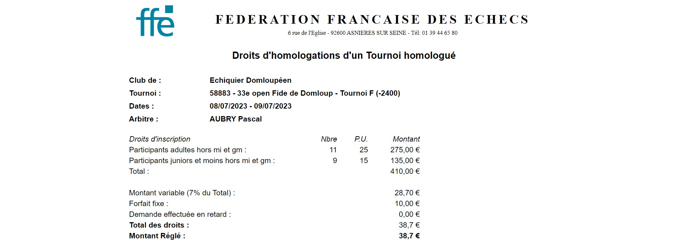

**[Retour au sommaire de la documentation](../README.md)**

# Papi-web - Configuration d'un tournoi homologué

Pour pouvoir utiliser les outils d'interface avec le site fédéral, il faut préciser le numéro d'homologation du tournoi et le code d'accès du tournoi sur le site fédéral de gestion des tournois.
```
[tournament]
path = C:\OneDrive\echecs\domloup\2023\tournois\officiel
filename = homologué-20230617
name = Tournoi homologué 17 juin 2023
ffe_id = 57777
ffe_password = KJGYREIOBZ
```
> [!NOTE]
> Lorsque l'on précise le numéro d'homologation (`ffe_id`), si `filename` n'est pas précisé alors Papi-web cherchera un fichier dont le nom est le numéro d'homologation (ici `57777.papi`), dans le répertoire précisé par `path` ou dans le répertoire `papi/` par défaut.

En précisant simplement `ffe_id` et `ffe_password`, les opérations sur le site fédéral seront accessibles en lançant le script `ffe.bat`.

> [!NOTE]
> Le numéro d'homologation et le code d'accès sont accessibles par les arbitres et les organisateurs sur le site fédéral dans la rubrique « Mon compte ».

Il est alors possible, en suivant les options proposées, d'effectuer les opérations suivantes.

## Test de la connexion au serveur fédéral

Cette étape permet de tester les identifiants fournis (`ffe_id` et `ffe_password`) en amont de la compétition.

```
Veuillez entrer le numéro de votre évènement :
  - [1] Tournoi amical 17 juin 2023 (amical.ini)
  - [2] 33e open Fide de Domloup (domloup-fide.ini)
  - [3] Championnat de France de parties rapides (france-rapide.ini)
  - [4] Tournoi homologué (homologation.ini)
  - [Q] Quitter
Votre choix : 4
Evènement : Tournoi homologué
Tournois : 47778
Actions :
  - [T] Tester les codes d'accès des tournois
  - [V] Rendre les tournois visibles sur le site fédéral
  - [H] Télécharger les factures d'homologation
  - [U] Mettre en ligne les tournois
  - [Q] Revenir à la liste des évènements
Entrez votre choix : T
Action : test des codes d'accès
INFO     Tournoi [47778] :
ERROR    L'authentification a échoué (vérifier les codes)
Evènement : Tournoi homologué
Tournois : 47778
Actions :
  - [T] Tester les codes d'accès des tournois
  - [V] Rendre les tournois visibles sur le site fédéral
  - [H] Télécharger les factures d'homologation
  - [U] Mettre en ligne les tournois
  - [Q] Revenir à la liste des évènements
Entrez votre choix : t
INFO     Configuration file [events\homologation.ini] has been modified, reloading...
Action : test des codes d'accès
INFO     Tournoi [47778] :
INFO     auth OK: http://www.echecs.asso.fr/FicheTournoi.aspx?Ref=47778
```

## Affichage du tournoi sur le site fédéral

> [!IMPORTANT]
> - Les tournois ne sont pas visibles au public tant qu'ils n'ont pas été rendus visbles par cette opération.
> - Pour rendre un tournoi visible, Papi-web commence par mettre en ligne le fichier du tournoi.

```
Veuillez entrer le numéro de votre évènement :
  - [1] Tournoi amical 17 juin 2023 (amical.ini)
  - [2] 33e open Fide de Domloup (domloup-fide.ini)
  - [3] Championnat de France de parties rapides (france-rapide.ini)
  - [4] Tournoi homologué (homologation.ini)
  - [Q] Quitter
Votre choix : 4
Evènement : Tournoi homologué
Tournois : 47778
Actions :
  - [T] Tester les codes d'accès des tournois
  - [V] Rendre les tournois visibles sur le site fédéral
  - [H] Télécharger les factures d'homologation
  - [U] Mettre en ligne les tournois
  - [Q] Revenir à la liste des évènements
Entrez votre choix : v
Action : affichage des tournois en ligne
INFO     Tournoi [47778] :
INFO     auth OK: http://www.echecs.asso.fr/FicheTournoi.aspx?Ref=47778
INFO     show OK
```

## Mise en ligne des résultats en temps-réel

Le tournoi est mis à jour sur le site fédéral dès qu'une modification a été apportée, via Papi-web ou directement depuis le logiciel Papi.

> [!WARNING]
> Lorsque la mise en ligne des résultats est activée, toutes les modifications effectuées dans le tournoi sont répercutées sur le site fédéral. Si vous souhaitez faire des opérations qui ne soient pas répercutées en ligne, il faut les effectuer sur une copie du fichier Papi ou arrêter temporairement la mise en ligne.

```
Veuillez entrer le numéro de votre évènement :
  - [1] Tournoi amical 17 juin 2023 (amical.ini)
  - [2] 33e open Fide de Domloup (domloup-fide.ini)
  - [3] Championnat de France de parties rapides (france-rapide.ini)
  - [4] Tournoi homologué (homologation.ini)
  - [Q] Quitter
Votre choix : 4
Evènement : Tournoi homologué
Tournois : 47778
Actions :
  - [T] Tester les codes d'accès des tournois
  - [V] Rendre les tournois visibles sur le site fédéral
  - [H] Télécharger les factures d'homologation
  - [U] Mettre en ligne les tournois
  - [Q] Revenir à la liste des évènements
Entrez votre choix : u
Action : mise en ligne des résultats
INFO     Mise à jour du tournoi [47778] (C:\OneDrive\echecs\papi-web\test\papi\47778.papi):
INFO     auth OK: http://www.echecs.asso.fr/FicheTournoi.aspx?Ref=47778
INFO     upload OK
INFO     Tous les tournois sont à jour
INFO     Tous les tournois sont à jour
INFO     Tous les tournois sont à jour
INFO     Tous les tournois sont à jour
INFO     Mise à jour du tournoi [47778] (C:\OneDrive\echecs\papi-web\test\papi\47778.papi):
INFO     auth OK: http://www.echecs.asso.fr/FicheTournoi.aspx?Ref=47778
INFO     upload OK
INFO     Tous les tournois sont à jour
INFO     Tous les tournois sont à jour
```


## Téléchargement de la facture d'homologation

> [!NOTE]
> La facture d'homologation est générée dans le répertoire `fees/`, qui est automatiquement créé au premier téléchargement d'une facture d'homologation.

```
Veuillez entrer le numéro de votre évènement :
  - [1] Tournoi amical 17 juin 2023 (amical.ini)
  - [2] 33e open Fide de Domloup (domloup-fide.ini)
  - [3] Championnat de France de parties rapides (france-rapide.ini)
  - [4] Tournoi homologué (homologation.ini)
  - [Q] Quitter
Votre choix : 4
Evènement : Tournoi homologué
Tournois : 59999
Actions :
  - [T] Tester les codes d'accès des tournois
  - [V] Rendre les tournois visibles sur le site fédéral
  - [H] Télécharger les factures d'homologation
  - [U] Mettre en ligne les tournois
  - [Q] Revenir à la liste des évènements
Entrez votre choix : H
Action : téléchargement des factures d'homologation
INFO     Tournoi [59999] :
INFO     auth OK: http://www.echecs.asso.fr/FicheTournoi.aspx?Ref=58878
INFO     Facture d'homologation enregistrée dans [fees\58878-fees.html]
INFO     fees OK
```

La facture d'homologation récupérée est stockée dans le répertoire `fees/<ffe_id>.html` et directement ouverte dans le navigateur.



Voir également : [Guide de référence de la configuration des évènements](40-ref.md)

