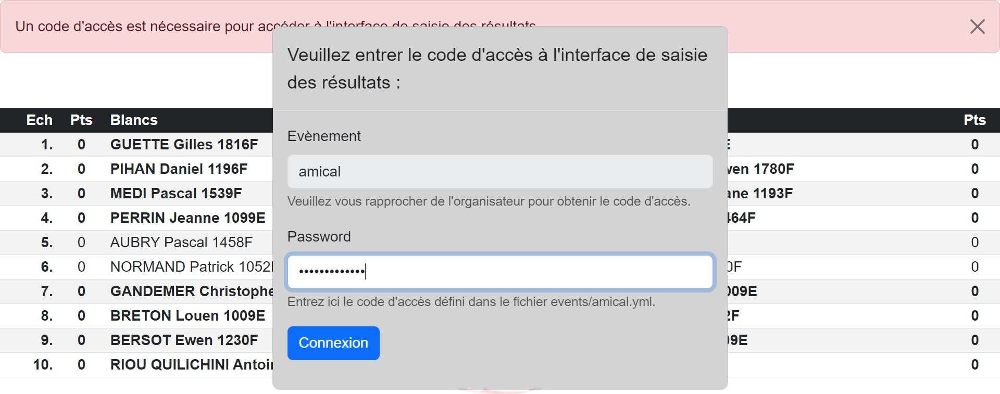
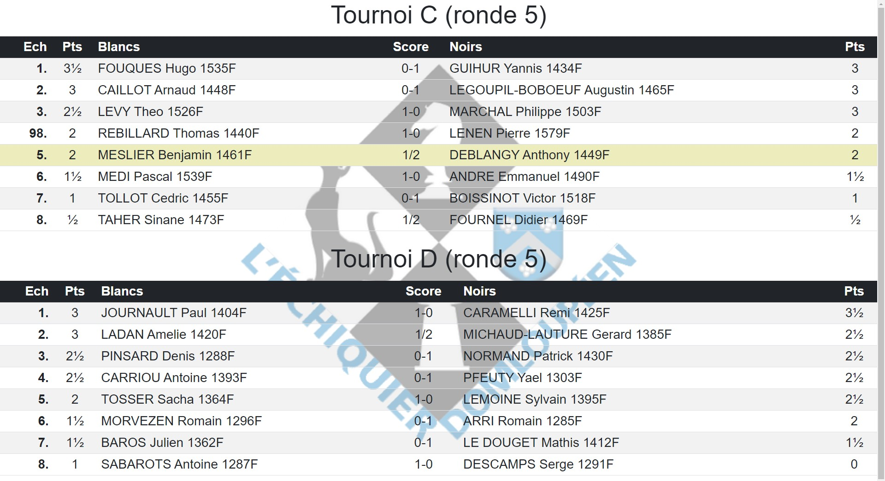
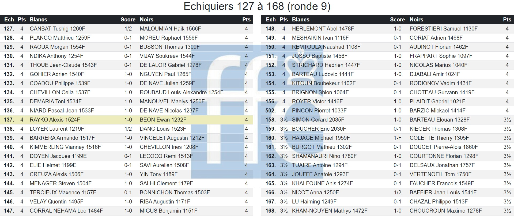

**[Retour au sommaire de la documentation](../README.md)**

# Papi-web - Saisie des résultats

> [!CAUTION]
> Cette page décrivant la configuration au format INI des écrans de saisie des résultats est obsolète et sera prochainement remplacée par un tutoriel.

La principale fonctionnalité attendue de Papi-web est celle de proposer une interface de saisie des résultats, délégable aux joueur·euses.

Comme dit dans la partie [Gestion d'un petit tournoi amical](11-friendly.md), la simple déclaration d'un tournoi crée automatiquement plusieurs écrans, dont un écran de saisie des résultats. Pour personnaliser son ou ses écrans de saisie des résultats, il faut le ou les déclarer manuellement.

> [!NOTE]
> Les options de personnalisation des menus sont décrites sur la page [Configuration des menus des écrans](33-menus.md).


## Déclaration d'un écran de saisie basique (`type = boards`, `update = on`)

On déclare un écran de saisie en créant une rubrique `[screen.<screen_id>]`, où `screen_id` est l'identifiant que vous aurez choisi pour votre écran. Vous pouvez par exemple déclarer un écran nommé `saisie` de la manière suivante :
```
[screen.saisie]
type = boards
update = on
```

Si vous n'avez qu'un seul tournoi dans votre évènement (`default`), alors vous pouvez vous contenter de cette déclaration et Papi-web présentera tous les échiquiers de votre tournoi sur l'écran :


Les utilisateurs peuvent entrer le résultat des parties en cliquant sur les échiquiers présentés :


## Déclaration d'un écran de saisie classique (`[screen.<screen_id>.boards]`)

Si vous avez plusieurs tournois dans votre évènement, vous devez préciser celui qui sera affiché en ajoutant une rubrique `[screen.<screen_id>.boards]` de la manière suivante :
```
[screen.saisie.boards]
tournament = principal
```

Tous les échiquiers du tournoi seront alors présentés à l'écran.

## Limitation des échiquiers présentés à l'écran (`part`/`parts`, `part`/`number` et `first`/`last`)

Vous pouvez préciser les échiquiers qui seront affichés sur l'écran en indiquant quelle partie des échiquiers sera présentée (ici le premier tiers des échiquiers - `1` sur `3` - sera présenté) :
```
[screen.saisie-1]
type = boards
update = on
[screen.saisie-1.boards]
tournament = principal
part = 1
parts = 3
```

Vous pouvez préciser les échiquiers qui seront affichés sur l'écran en indiquant le nombre d'échiquiers 
qui sera présenté sur chaque écran (ici le deuxième écran de 30 échiquiers, soit les échiquiers de `31` sur `60` inclus) :
```
[screen.saisie-1]
type = boards
update = on
[screen.saisie-1.boards]
tournament = principal
part = 2
number = 30
```

Vous pouvez également spécifier directement les échiquiers qui seront présentés en donnant le numéro du premier `first = 1` et le numéro du dernier `last = 20` (ici les échiquiers n° 1 à 20 seront présentés) :

```
[screen.saisie-1]
type = boards
update = on
[screen.saisie-1.boards]
tournament = principal
first = 1
last = 20
```

Les options `part`/`parts` et `part`/`number` doivent toujours être utilisées ensemble (les options `parts` et `number` sont incompatibles).

> [!NOTE]
> Depuis la version 2.4, les options `first`/`last` peuvent être utilisées en même temps que `part`/`parts` ou `part`/`number` (par défaut `first` vaut 1 et `last` vaut le numéro du dernier échiquier).

## Protection de l'accès aux écrans de saisie (`[event] update_password`)

Afin de ne pas mettre en péril les résultats d'un évènement, il est fortement conseillé de protéger l'accès aux écrans de saisie par un code, défini dans la rubrique `[event]` de la configuration de votre évènement :

```
[event]
name = Mon évènement
update_password = mon code d'accès
```

Ce code devra être renseigné lors du premier accès à l'écran de saisie :



> [!IMPORTANT]
> La protection mise en place reste succinte, elle a essentiellement pour objectif de limiter les mauvaises manipulations. En particulier, l'intrusion sur le réseau local utilisé par Papi-Web peut mener à des attaques de type « man-in-the-middle » puisque les communications HTTP avec le serveur Papi-web ne sont pas chiffrées. Afin de complètement se protéger, l'accès au réseau local (filaire ou Wi-Fi) doit être limité aux arbitres et aux organisateur·ices (par exemple, la clé Wi-Fi du réseau local ne doit pas être partagée).


## Saisie de résultats de plusieurs tournois sur un même écran (`[screen.<screen_id>.boards.<set_id>]`)

Par exemple dans le cas de l'organisation de petits tournois par niveaux, il peut être intéressant de saisir les résultats de plusieurs tournois sur un même écran, pour limiter le nombre d'écrans.

Pour ce faire, on n'utilise plus la rubrique `[screen.<screen_id>.boards]` mais plusieurs sous-rubriques correspondant à plusieurs ensembles d'échiquiers. Par exemple pour grouper sur un même écran deux tournois C et D d'un même évènement, on utilisera :

```
[event]
name = Tournois par niveaux

[tournament.C]
name = tournoi C

[tournament.D]
name = tournoi D

[screen.saisie-CD]
type = boards
update = on
name = Saisie tournois C et D
[screen.saisie-CD.boards.C]
tournament = C
[screen.saisie-CD.boards.D]
tournament = D
```



> [!NOTE]
> Il est tout à fait possible dans chaque ensemble d'échiquiers de limiter les échiquiers présentés, comme vu précédemment avec les options `first`/`last` ou `part`/`parts`.

## Personnalisation des écrans de saisie (`columns`)

Il est possible de présenter les échiquiers d'un écran sur plusieurs colonnes, par exemple :

```
[screen.saisie-4]
type = boards
update = on
columns = 2
[screen.saisie-4.boards]
part = 4
parts = 6
```



Voir également : [Guide de référence de la configuration des évènements](40-ref.md)

