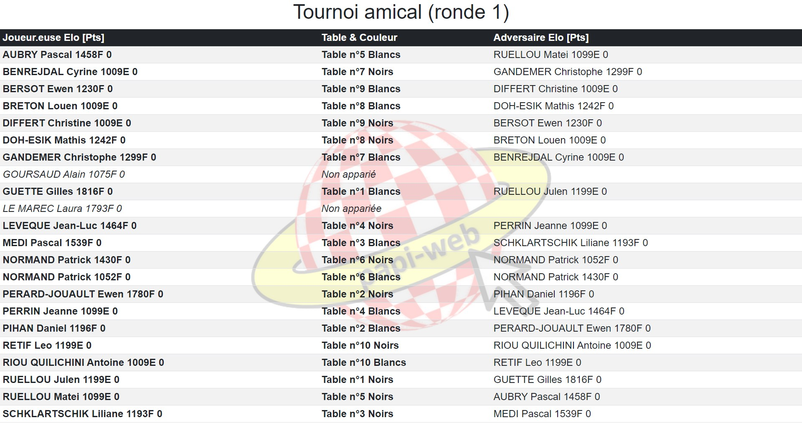

**[Retour au sommaire de la documentation](../README.md)**

# Affichage des appariements par ordre alphabétique

L'affichage par ordre alphabétique permet aux joueur·euses de trouver beaucoup plus rapidement leur table à chaque ronde, il est particulièrement important pour les tournois à forte participation pour lesquels les niveaux de points des appariements peuvent être très fournis.

La déclaration des écrans par ordre alphabétique est détaillée ci-dessous, on notera qu'elle ressemble énormément à celle des écrans par échiquier, aux exceptions suivantes :

- on utilise `type = players` à la place de `type = boards` ;
- l'option `update` n'existe pas.

Comme dit dans la partie [Gestion d'un petit tournoi amical](11-friendly.md), la simple déclaration d'un tournoi crée automatiquement plusieurs écrans, dont un écran d'affichage par ordre alphabétique. Pour personnaliser son ou ses écrans par ordre alphabétique, il faut le ou les déclarer manuellement.

> [!NOTE]
> Les options de personnalisation des menus sont décrites sur la page [Configuration des menus des écrans](34-menus.md).

## Déclaration d'un écran par ordre alphabétique basique (`type = players`)

On déclare un écran par ordre alphabétique en créant une rubrique `[screen.<screen_id>]`, où `screen_id` est l'identifiant que vous aurez choisi pour votre écran. Vous pouvez par exemple déclarer un écran nommé `alpha` de la manière suivante :
```
[screen.alpha]
type = players
```

Si vous n'avez qu'un seul tournoi dans votre évènement (`default`), alors vous pouvez vous contenter de cette déclaration et Papi-web présentera tou·tes les joueur·euses de votre tournoi sur l'écran :




## Déclaration d'un écran par ordre alphabétique classique  (`[screen.<screen_id>.players]`)

Si vous avez plusieurs tournois dans votre évènement, vous devez préciser celui qui sera affiché en ajoutant une rubrique `[screen.<screen_id>.players]` de la manière suivante :
```
[screen.saisie.players]
tournament = principal
```

Tous les joueur·euses du tournoi seront alors présenté·es à l'écran.

## Limitation des joueur·euses présenté·es à l'écran (`part`/`parts` et `first`/`last`)

Vous pouvez préciser les joueur·euses qui seront affiché·es sur l'écran en indiquant quelle partie des joueur·euses sera présentée (ici le premier tiers des joueur·euses - `1` sur `3` - sera présenté) :
```
[screen.alpha-1]
type = players
[screen.alpha-1.players]
tournament = principal
part = 1
parts = 3
```

Vous pouvez également spécifier directement les joueur·euses qui seront présenté·es en donnant le numéro du premier `first = 1` et le numéro du dernier `last = 20` (ici les joueur·euses n° 1 à 20 seront présenté·es) :

```
[screen.alpha-1]
type = players
[screen.alpha-1.players]
tournament = principal
first = 1
last = 20
```


> [!NOTE]
> Comme pour les écrans de saisie :
> - les options `part`/`parts` doivent toujours être utilisées ensemble, et sont incompatibles avec les options `first`/`last` ;
> - les options `first`/`last` sont incompatibles avec les options `part`/`parts`, par défaut `first` vaut 1 et `last` vaut le numéro du dernier échiquier.

## Affichage des appariements des joueur·euses e plusieurs tournois sur un même écran (`[screen.<screen_id>.players.<set_id>]`)

Par exemple dans le cas de l'organisation de petits tournois par niveaux, il peut être intéressant d'afficher les appariements par ordre alphabétique de plusieurs tournois sur un même écran, pour limiter le nombre d'écrans.

Pour ce faire, on n'utilise plus la rubrique `[screen.<screen_id>.players]` mais plusieurs sous-rubriques correspondant à plusieurs ensembles de joueur·euses. Par exemple pour grouper sur un même écran deux tournois C et D d'un même évènement, on utilisera (il est également possible de présenter les joueur·euses d'un écran sur plusieurs colonnes) :

```
[event]
name = Tournois par niveaux

[tournament.C]
name = tournoi C

[tournament.D]
name = tournoi D

[screen.alpha-CD]
type = boards
update = on
name = Appariements tournois C et D
columns = 2
[screen.alpha-CD.players.C]
tournament = C
[screen.alpha-CD.players.D]
tournament = D
```


> [!NOTE]
> Il est tout à fait possible dans chaque ensemble de limiter les joueur·euses présenté·es, comme vu précédemment avec les options `first`/`last` ou `part`/`parts`.

Voir également : [Guide de référence de la configuration des évènements](40-ref.md)

