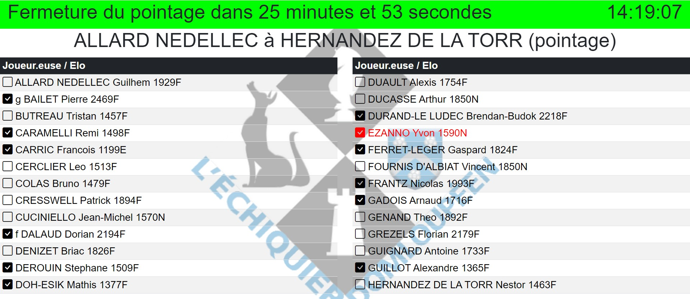

**[Retour au sommaire de la documentation](../README.md)**

# Pointage

> [!CAUTION]
> Cette page décrivant le pointage des joueur·euses est obsolète et sera prochainement remplacée par un tutoriel.

Le statut (pointé·e/non pointé·e) est indiqué en temps-réel sur la liste des joueur·euses avant l'affichage des premiers appariements.

À partir de la version 2.3, le pointage peut être réalisé depuis les écrans de saisie.

> [!NOTE]
> Le pointage effectué sur la plateforme ChessEvent remplace celui fait dans les fichiers Papi, directement avec Papi ou avec Papi-web ; il est donc déconseillé d'utiliser à la fois ChessEvent et Papi-web pour le pointage.

