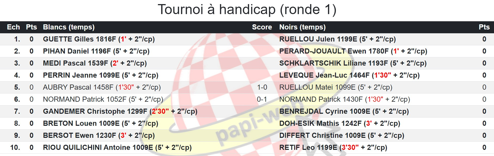

**[Retour au sommaire de la documentation](../README.md)**

# Papi-web - Configuration d'un tournoi à handicap

Les tournois à handicap ne sont pas homologués mais sont particulièrement appréciés dans les clubs pour des tournois rapides avec de forts écarts de niveau entre les joueur·euses : les joueur·euses les mieux classé·es disposent de moins de temps à la pendule, en fonction de la différence de classement).

Papi-web permet de configurer le handicap et afficher automatiquement les temps à appliquer aux joueur·euses à chaque ronde en fonction des appariements. Par exemple, la configuration ci-dessous correspond à un blitz de 5 minutes et 2 secondes par coup, avec une pénalité de 30 secondes par tranche de 50 points et un minimum de 1 minute :

```
[tournament.<tournament_id>.handicap]
initial_time = 300
increment = 2
penalty_step = 50
penalty_value = 30
min_time = 60
```

Lorsqu'un évènement ne comprend qu'un seul évènement alors l'identifiant `<tournament_id>` peut être omis (on utilise simplement `[tournament.handicap]`).

