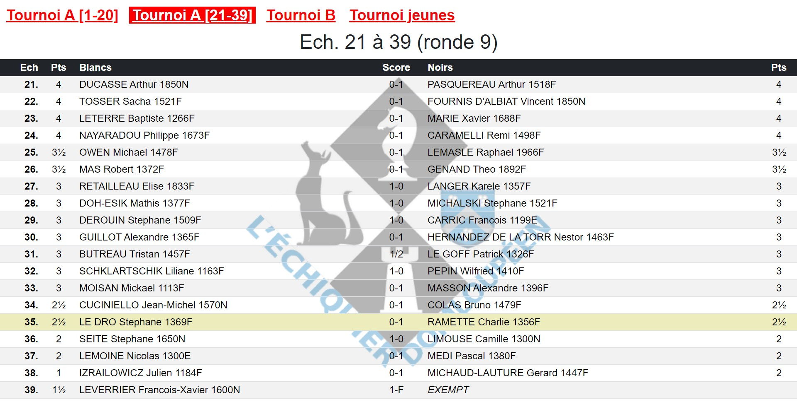

**[Retour au sommaire de la documentation](../README.md)**

# Papi-web - Configuration des menus des écrans

Lorsque l'on utilise plusieurs écrans, les menus permettent de passer facilement d'un menu à un autre.

Dans la rubrique `[screen.<screen_id>]` d'un écran, deux options servent à gérer les menus :
- `menu` permet de définir le menu qui sera affiché sur l'écran ;
- `menu_text` permet de définir le texte du lien hypertexte de cet écran dans les menus.

> [!NOTE]
> L'option `menu_text` est nécessaire pour qu'un écran apparaisse dans les menus.

## Définition du menu affiché sur un écran

L'option `menu` peut avoir les valeurs suivantes :

### Aucun menu : `menu = none`

Aucun menu ne sera affiché sur cet écran (par exemple, il n'est en général pas nécessaire d'afficher des liens hypertextes puisque la navigation entre les écrans est automatique). `menu = none` est la valeur par défaut.

### Visualisation : `menu = @view`

Le menu contiendra des liens vers tous les écrans de l'évènement :
- affichage des appariements par échiquier
- affichage des appariements par ordre alphabétique
- affichage des résultats

### Saisie : `menu = @update`

Le menu contiendra des liens vers tous les écrans de saisie de l'évènement.

### Famille (de l'écran) : `menu = @family`

Le menu contiendra des liens vers tous les écrans de la famille de l'écran (cette valeur n'est autorisée que pour les écrans d'une famille).

#### Ajout d'écrans supplémentaires : `menu = @family, <écran n°1, ...>`

Le menu contiendra des liens vers tous les écrans de la famille d'écran comme au point précédent, et contiendra également des liens vers les écrans spécifiés (voir le point suivant).

### Liste d'écrans : `menu = <écran n°1, ...>`

Le menu contiendra des liens vers les écrans dont on indique la liste des identifiants, séparés par des virgules.

## Définition du lien hypertexte d'un écran

L'option `menu_text` est une chaîne de caractère libre.

Avant d'être affichée à l'écran, les remplacements suivants sont effectués :
- `%t` est remplacé par le nom du tournoi concerné par l'écran
- `%f` (f = first) est remplacé par le numéro du premier échiquier ou les trois premières lettres du nom du·de la premier·ère joueur·euse
- `%l` (l = last) est remplacé par le numéro du dernier échiquier ou les trois premières lettres du nom du·de la dernier·ère joueur·euse

> [!NOTE]
> Si l'écran présente plusieurs ensembles concernant plusieurs tournois, le tournoi du premier ensemble sera considéré pour les remplacements.

## Exemple

```
[tournament.a]
ffe_id = 59999
name = A

[tournament.b]
ffe_id = 60000
name = B

[tournament.j]
ffe_id = 60000
name = jeunes

[screen.a-1]
type = boards
update = on
menu = a-1, a-2, b, j
menu_text = %t
[screen.a-1.boards]
tournament = a
parts = 2
part = 1

[screen.a-2]
type = boards
update = on
menu = a-1, a-2, b, j
menu_text = %t
[screen.a-2.boards]
tournament = a
parts = 2
part = 2

[screen.b]
type = boards
update = on
menu = a-1, a-2, b, j
menu_text = %t
[screen.b.boards]
tournament = b

[screen.j]
type = boards
update = on
menu = a-1, a-2, b, j
menu_text = %t
[screen.j.boards]
tournament = j
```



Voir également : [Guide de référence de la configuration des évènements](40-ref.md)

