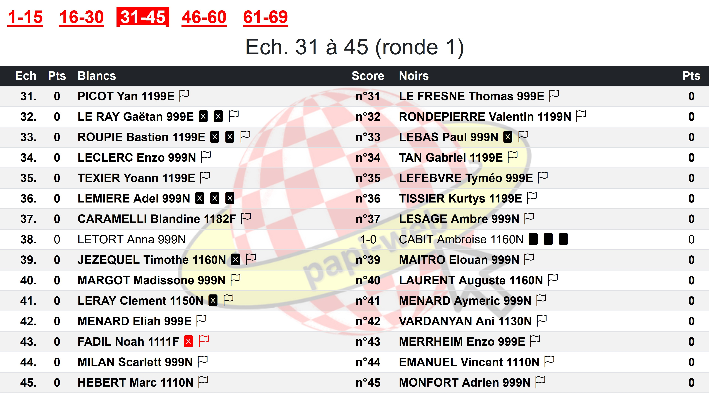

**[Retour au sommaire de la documentation](../README.md)**

# Papi-web - Enregistrement des coups illégaux

> [!NOTE]
> Cette fonctionnalité n'est disponible qu'à partir de la version 2.2 de Papi-web.<br/>

## Généralités

Le nombre de coups illégaux autorisés au cours d'une partie est en général 1 (le deuxième fait perdre la partie), parfois 2 (pour certains tournois scolaires).

L'enregistrement des coups illégaux des joueur·euses est en général manuel (noté sur papier par les arbitres) ou bien en distribuant des cartons aux joueur·euses qui commettent des coups illégaux.

À partir de la version 2.2, Papi-Web permet d'enregistrer les coups illégaux, ce qui permet de partager leur enregistrement sur l'interface de saisie des résultats si les arbitres sont munis d'une tablette connectée à Papi-web.

## Configuration sur tous les écrans de saisie des résultats

Pas défaut, l'enregistrement des coups illégaux n'est pas activé.

L'activation se configure à l'aide de la rubrique `[event]`.

En utilisant la valeur `on`, on enregistre par défaut jusqu'à 2 coups illégaux par joueur·euse par partie sur les écrans de saisie des résultats.

```
[event]
record_illegal_moves = on
```

On peut également spécifier un entier positif (`0` équivaut à `off`) :

```
[event]
record_illegal_moves = 1
```

## Configuration sur un écran spécifique

La valeur par défaut spécifiée dans la rubrique `[event]` peut être modifiée pour chaque écran :

```
[screen.saisie-ecoles]
record_illegal_moves = 3
```

## Visualisation sur les écrans de saisie

| Symbole                                                                    | Signification                                                           |
|----------------------------------------------------------------------------|-------------------------------------------------------------------------|
|        | Coup illégal enregistré sur une partie terminée                         |
|  | Coup illégal enregistré sur une partie en cours, cliquer pour supprimer |
|             | Lien pour ajouter un coup illégal sur une partie en cours               |


