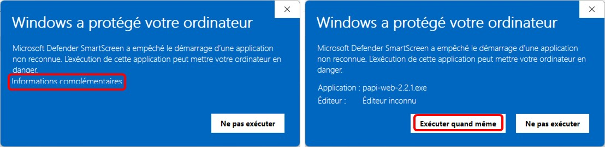
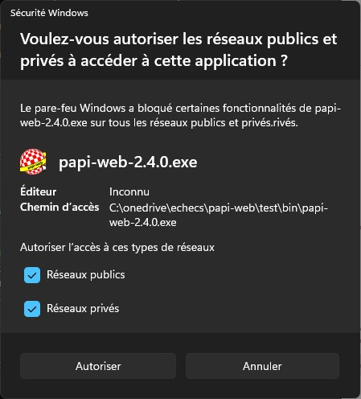
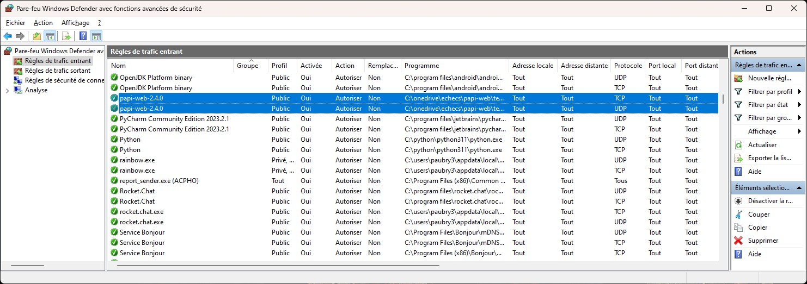

**[Retour au sommaire de la documentation](../README.md)**

# Papi-web - Foire Aux Questions

## Système

### La bibliothèque `api-ms-win-core-path-l1-1.0.dll` est manquante

Il s'agit d'une incompatibilité entre Windows 7 et la version de Python utilisée (3.9+), il faut mettre à jour la version de Windows utilisée (Windows 7 n'est plus supporté depuis janvier 2020).

### Microsoft Defender Smartscreen a empêché le démarrage d'une application non reconnue

Dans la version actuelle de Papi-web, Microsoft Defender SmartScreen affiche l'erreur ci-dessus.

Le seul moyen de contourner cette erreur est de cliquer sur **Informations complémentaires** puis **Exécuter quand même**.  

### Blocage du serveur web par le pare-feu du serveur

Par défaut, il est possible que le serveur web ne soit pas autorisé par le pare-feu du serveur, comme par exemple ici avec Microsoft Defender :

Selon votre pare-feu, le message pourra être différent et la méthode d'ouverture des ports nécessaires pourra également différer ; 
si nécessaire, contactez votre administrateur réseau pour ouvrir les flux entrants du serveur (par défaut le port 80 en tcp/udp, ci-dessous l'autorisation ).

## Chronomètre

### Les clients affichent des horaires différents

L'heure des chronomètres affichée sur les clients est l'heure des clients (pas celle du serveur), il faut donc synchroniser tous les clients sur un même serveur de temps.

