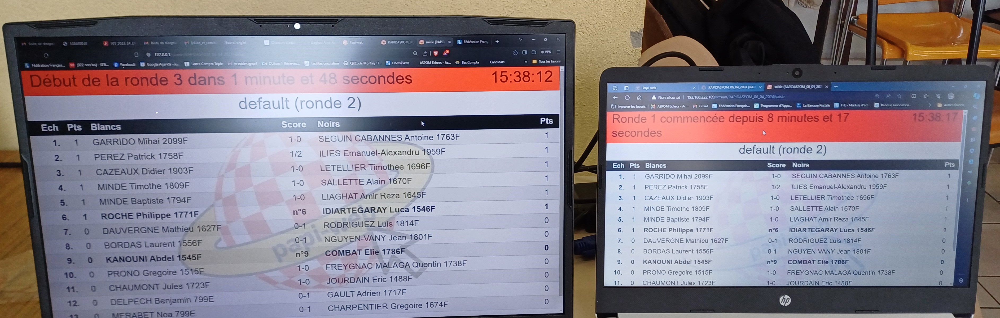

**[Retour au sommaire de la documentation](../README.md)**

# Papi-web - Foire aux questions

## Chronomètre

### Mes clients affichent des horaires différents, que faire ?

L'heure des chronomètres affichée sur les clients est l'heure des clients (pas celle du serveur), il faut donc synchroniser tous les clients sur un même serveur de temps.

