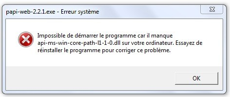

**[Retour au sommaire de la documentation](../README.md)**

# Papi-web - Foire Aux Questions

## Système

### La bibliothèque `api-ms-win-core-path-l1-1.0.dll` est manquante

Il s'agit d'une incompatibilité entre Windows 7 et la version de Python utilisée (3.9+), il faut mettre à jour la version de Windows utilisée (Windows 7 n'est plus supporté depuis janvier 2020).

### Microsoft Defender Smartscreen a empêché le démarrage d'une application non reconnue

Dans la version actuelle de Papi-web, Microsoft Defender SmartScreen affiche l'erreur ci-dessus.

Le seul moyen de contourner cette erreur est de cliquer sur **Informations complémentaires** puis **Exécuter quand même**.  

## Chronomètre

### Les clients affichent des horaires différents

L'heure des chronomètres affichée sur les clients est l'heure des clients (pas celle du serveur), il faut donc synchroniser tous les clients sur un même serveur de temps.

